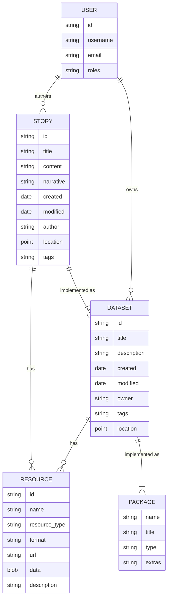
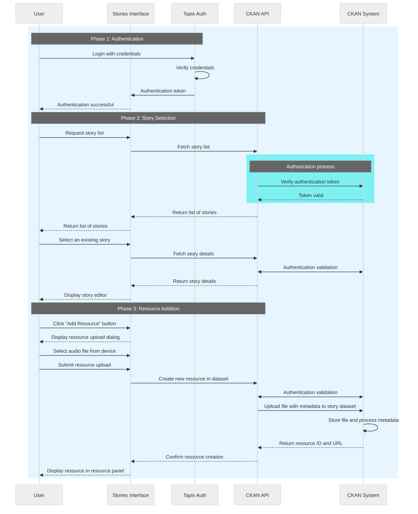
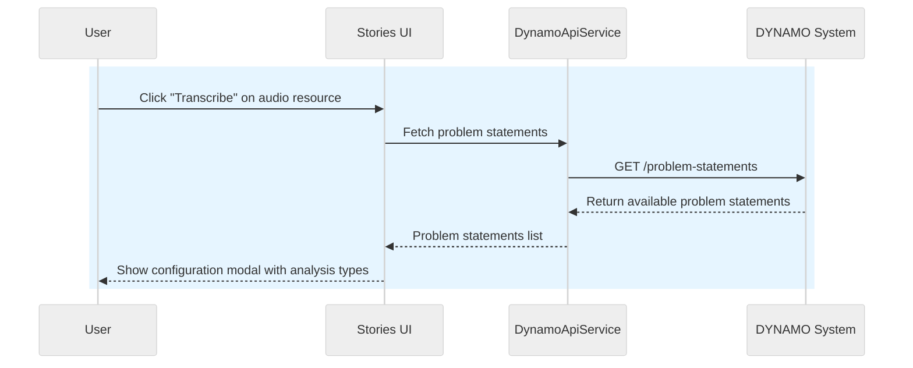
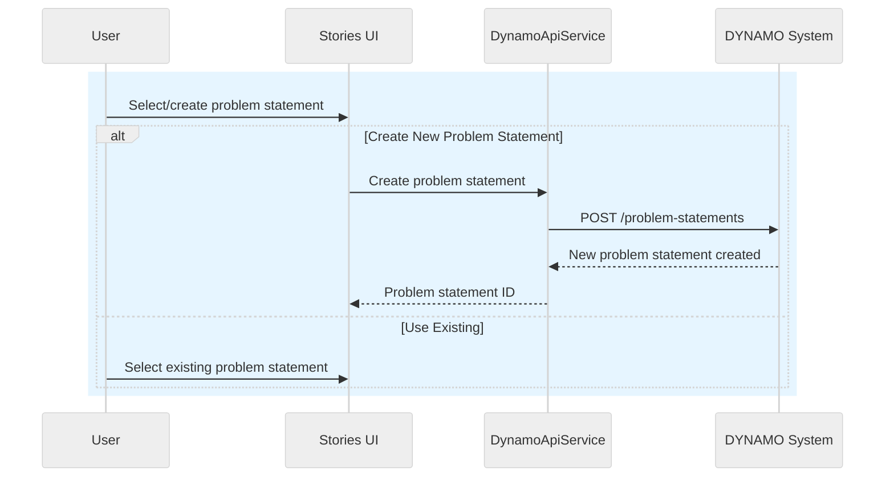
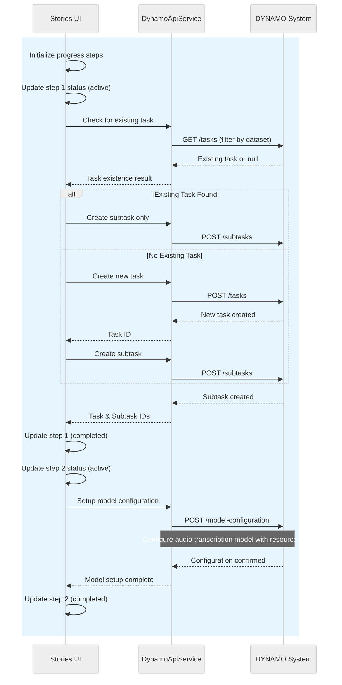
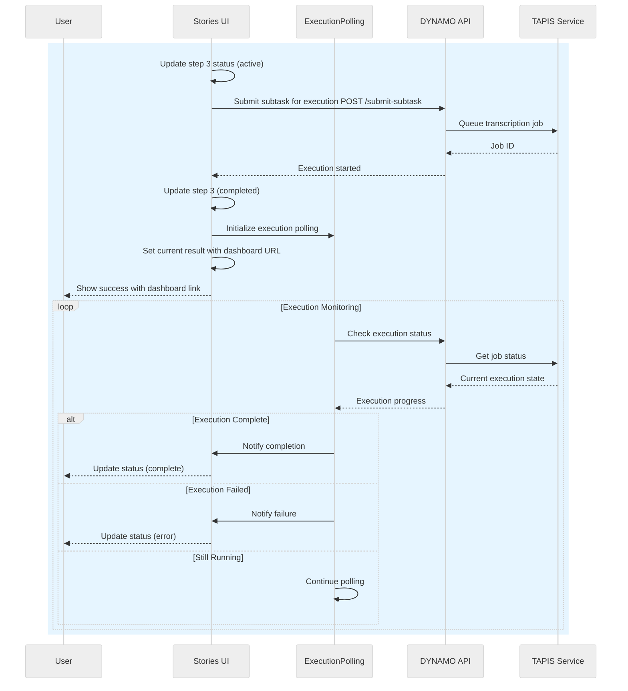

# Stories Interface Architecture Design

This document describes the user workflow and system architecture for the Stories Interface application, a React-based platform for capturing and displaying stories with integrated resource management capabilities.

## Entity Relationship Diagram

The Stories Explorer platform bridges the gap between technical data management and narrative storytelling by enabling users to create rich, multimedia stories that incorporate scientific datasets, geographic information, and media resources. The platform serves researchers, communities, and decision-makers who need to communicate complex information in accessible formats while maintaining proper data stewardship.

### Key Components

- **CKAN**: The open-source data management system that serves as the backend for storing, managing, and distributing datasets and resources. CKAN provides APIs for data access, search, and organization.
- **Stories Interface**: The user-facing application that allows for the creation, editing, and viewing of narrative content that incorporates data resources. Stories are stored as specialized datasets in CKAN.
- **Stories**: A specialized dataset type in CKAN used to store story content, including text, embedded media, and references to other resources. **Note**: [Schema definition is currently undefined and needs to be implemented](https://github.com/In-For-Disaster-Analytics/stories-ui/issues/15).

## System Overview

The Stories Interface enables users to create and manage stories by uploading and organizing various media resources including audio files, documents, and images. The system integrates with Tapis authentication and CKAN for dataset management.

## Stories retrieval and resources creation

This sequence diagram illustrates the complete user journey through the Stories Interface application across three distinct phases:

### Phase 1: Authentication

- **User Authentication**: Users authenticate through the Tapis authentication system using their credentials
- **Token Management**: Upon successful verification, Tapis provides an authentication token to the Stories Interface
- **Session Establishment**: The interface confirms authentication success, enabling access to protected features

### Phase 2: Story Selection and Management

- **Story Discovery**: Users can browse and request lists of available stories from the system
- **Authorization Validation**: The CKAN API validates authentication tokens with the CKAN System for each request
- **Story Access**: Users select existing stories and access the story editor interface with full story details

### Phase 3: Resource Addition and Integration

- **Resource Upload Interface**: Users access the resource addition dialog to upload various file types
- **File Processing**: The system handles file uploads including audio interviews, documents, and media files
- **Metadata Management**: CKAN processes uploaded files, generates metadata, and stores resources with unique identifiers
- **Resource Integration**: Successfully uploaded resources appear in the resource panel for embedding within stories

## Key System Components

- **Stories Interface**: React-based frontend application with TypeScript
- **Tapis Auth**: Authentication service managing user credentials and JWT tokens
- **CKAN API**: RESTful API handling dataset and resource management operations
- **CKAN System**: Backend data management system storing files, metadata, and story datasets

## Security and Authentication

The system implements comprehensive authentication validation at each API interaction, ensuring secure access to stories and resources. JWT tokens are validated consistently across all CKAN operations, maintaining data integrity and user access controls.

## Audio Transcription Workflow

The transcription system integrates with DYNAMO Ensemble Manager to provide automated audio/video transcription capabilities. The workflow is broken down into four main phases, each represented by separate sequence diagrams:

### Phase 1: List problem statements and analysis types

- Stories UI fetches available problem statements and analysis types

### Phase 2: Problem Statement & Task Setup

- User selects or creates problem statements with regional and temporal scope

### Phase 3: Task Creation & Model Setup

- Stories UI checks for existing tasks to avoid duplication
- Creates new tasks/subtasks as needed in DYNAMO system
- Configures audio transcription model with specific resource data

### Phase 4: Analysis Submission & Monitoring

- Subtask is submitted to DYNAMO for execution
- ExecutionPolling component monitors transcription progress in background
- Users receive dashboard links for real-time status monitoring
- System handles completion, failure, and ongoing execution states

The unified transcription interface combines modal UI with the useTranscription hook logic, providing comprehensive error handling, progress tracking, and integration with the DYNAMO dashboard for advanced monitoring capabilities.

