# Modeler/Data Scientist User Flow - Mermaid Diagram

```mermaid
flowchart TD
    Start([Modeler/Data Scientist Accesses System]) --> Auth{Authentication via CKAN}
    Auth -->|Success| Dashboard[PTDataX<br/>Modeler Dashboard]
    Auth -->|Failure| AuthError[Authentication Error]
    AuthError --> Start

    Dashboard --> DataSource{Data Source}
    DataSource -->|New Data| UploadData[Upload data via<br/>web forms]
    DataSource -->|Existing Data| SelectData[Select from<br/>CKAN catalog]

    UploadData --> StoreCorral[System: Data stored<br/>in Corral]
    StoreCorral --> ProcessData[PTDataX: Process data &<br/>register metadata in CKAN]
    SelectData --> BrowseApps[Browse TAPIS Applications]
    ProcessData --> BrowseApps

    BrowseApps --> AppOptions[Available Applications:<br/>• Modflow<br/>• Whisper transcription<br/>• Other simulations]
    AppOptions --> SelectApp[Select Application]
    SelectApp --> ConfigureJob[Configure job parameters]
    ConfigureJob --> SelectInput[Select input data]
    SelectInput --> SubmitJob[Submit job to TAPIS]

    SubmitJob --> JobExecution[TAPIS Executes Job]
    JobExecution --> MonitorJob[Monitor execution via<br/>webhook notifications]
    MonitorJob --> RealTimeUpdates[Receive real-time updates<br/>through PTDataX]
    RealTimeUpdates --> JobComplete{Job Complete?}

    JobComplete -->|No| MonitorJob
    JobComplete -->|Yes| ViewOutputs[View job outputs]
    ViewOutputs --> RegisterOutputs[System: Outputs auto-registered<br/>in CKAN with metadata<br/>• Dataset Description<br/>• Provenance Information<br/>• Access Permissions]

    RegisterOutputs --> AccessResults[Access completed results]
    AccessResults --> MakeAvailable[Results available for<br/>Technical Analysts]
    MakeAvailable --> NewWorkflow{Start new workflow?}

    NewWorkflow -->|Yes| BrowseApps
    NewWorkflow -->|No| End([End])

    %% Error Handling
    SubmitJob --> JobError{Job Failed?}
    JobError -->|Yes| ErrorNotification[Error Notification<br/>Technical Details Provided]
    ErrorNotification --> ConfigureJob
    JobError -->|No| JobExecution

    %% System Components
    subgraph SystemComponents [Supporting System Components]
        CKAN_System[CKAN<br/>• Authentication<br/>• Data Catalog<br/>• Metadata Management]
        TAPIS_System[TAPIS<br/>• Job Execution<br/>• Application Management]
        PTDataX_System[PTDataX<br/>• Technical Interface<br/>• Advanced Configuration]
        Corral_System[Corral<br/>• Data Storage]
    end

    %% Styling
    classDef userAction fill:#3498db
    classDef systemProcess fill:#2ecc71
    classDef systemTask fill:#95a5a6
    classDef decision fill:#f1c40f
    classDef error fill:#e74c3c
    classDef output fill:#9b59b6

    class Dashboard,SelectData,SelectApp,ConfigureJob,SelectInput userAction
    class ProcessData,JobExecution,MonitorJob,RealTimeUpdates systemProcess
    class StoreCorral,RegisterOutputs systemTask
    class Auth,DataSource,JobComplete,NewWorkflow,JobError decision
    class AuthError,ErrorNotification error
    class AccessResults,MakeAvailable output
```

## Legend

| Color | Type | Description |
|-------|------|-------------|
| 🔵 Blue (#3498db) | User Actions | Tasks performed directly by the Modeler/Data Scientist |
| 🟢 Green (#2ecc71) | System Processes | Operations executed by system components (TAPIS, PTDataX) |
| ⚪ Gray (#95a5a6) | System Tasks | Automated system operations (Corral storage, CKAN registration) |
| 🟡 Yellow (#f1c40f) | Decisions | Decision points or conditional logic in the workflow |
| 🔴 Red (#e74c3c) | Error Handling | Error states and error notifications |
| 🟣 Purple (#9b59b6) | Outputs | Final deliverables and results for downstream users |