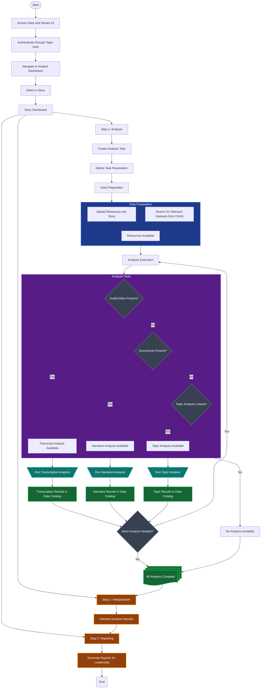

# Analyst User Flow - Flowchart

Based on the analyst workflow described in `flow.md`, this flowchart represents the complete user journey for technical analysts using the Stories UI system.

## Key Features of this Flow:

### Authentication & Setup

- Standard authentication through Tapis Auth
- Story selection from available stories

### Three-Phase Structure

1. **Analysis**: Fully detailed with data preparation and execution
2. **Interpretation**: Placeholder for future development
3. **Reporting**: Placeholder for future development

### Analysis Tools Logic

- **Transcript Analysis**: Enabled when audio/video files are present
- **Narrative Analysis**: Enabled when document files are present
- **Topic Analysis**: Criteria not yet defined (marked as future work)

### Data Sources & Analysis Flow

- Upload new resources directly into the story
- Search and select from existing CKAN datasets (future enhancement)
- **Iterative Analysis**: Analysis results become available as new resources for subsequent analyses
  - Example: Transcription analysis generates documents that can feed Narrative analysis
  - Results are automatically registered in the Data Catalog, expanding available resources
- **Analysis Chaining**: Multiple analysis types can be run sequentially using previous results

## Notes:

- The flowchart focuses on the MVP scope with detailed Analysis phase
- Interpretation and Reporting phases are placeholders for future development
- Topic analysis enablement criteria needs to be defined
- Dataset search functionality is marked for future implementation
